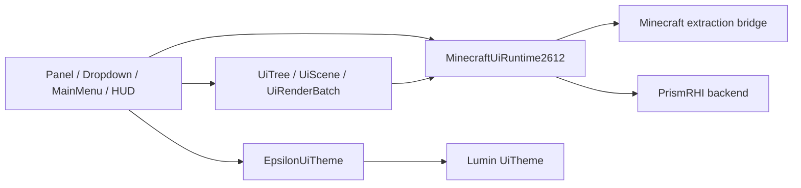

# Lumin GUI 集成边界

## 定位

Epsilon 不再维护 `com.github.epsilon.gui.lib`。声明式节点树、场景、批次、主题契约、文本测量、
scissor、纹理和模糊区域统一使用 LuminGraphics 与 LuminGraphics-MC 的公共 API：

- `com.github.slmpc.lumingraphics.ui.*`
- `com.github.slmpc.lumingraphics.text.*`
- `com.github.slmpc.lumingraphics.mc.v2612.*`

`common` 只保留 Panel、Dropdown、HUD Editor、MainMenu 等业务组件，以及
`EpsilonUiTheme`、`UiCoordinateMapper` 和 Minecraft 事件接入。公共 Lumin API 不得反向依赖
Module、Setting、Holder 或 Manager。

## 依赖方向



`common` 可以调用 Minecraft API，但上述集成不得导入 Fabric 或 NeoForge 类型。平台入口只负责
把当前 Minecraft context 和加载器生命周期绑定到 LuminGraphics-MC。

## 场景与帧

Screen 在活动渲染帧中取得 runtime，配置字体并让 runtime 驱动场景：

```java
MinecraftUiRuntime2612 runtime = MinecraftUiRuntime2612.current();
ClientSetting.INSTANCE.configureMinecraftFonts(runtime);
runtime.render(scene(runtime), activeScene -> {
    UiTree tree = UiTree.build(scope -> {
        scope.roundRect(x, y, width, height, radius, EpsilonUiTheme.lumin(background));
        scope.text(label, textX, textY, scale, EpsilonUiTheme.lumin(foreground));
    });
    activeScene.submit(UiLayer.CONTENT, tree);
});
```

持有 `UiScene` 的对象必须同时记录创建它的 runtime。runtime 变化、Screen 移除、模块禁用或 Holder
关闭时调用 `close()`，不得跨 runtime 复用场景。HUD 使用 `HudElementHolder` 统一构建一棵树；
单个 `HudModule` 只能向调用方提供的 scope 追加节点。

## Layer 规则

存在遮挡关系的 pass 必须使用不同的整数 layer。可使用
`UiRenderBatch.render(tree, relativeLayer)`、`UiScene.batch(layer, relativeLayer)` 或
`UiTree.Scope.layer(relativeLayer, ...)` 明确表达顺序。

- Screen chrome、内容和 popup 使用各自语义 layer。
- Dropdown 的 scrim、Panel background/content、搜索区和 popup 使用递增 layer。
- HUD Editor chrome 与 HUD 预览分别提交，不能把 HUD 节点混入 editor tree。
- 同一 layer 内不得依赖不同 pipeline 的隐式提交顺序。

## 坐标与输入

Lumin 使用 runtime 的逻辑 surface 尺寸。Screen 输入通过 `UiCoordinateMapper` 转换到投影坐标，
不得再次按 GUI scale 缩放。世界 2D 覆盖层使用 `WorldToScreen.calcWorld2Screen`；AABB 必须投影
8 个顶点后取屏幕边界。

## 字体与主题

字体由 `ClientSetting.configureMinecraftFonts(runtime)` 注册，文本测量和绘制必须使用同一 scale
与 font id。Epsilon 主题颜色通过 `EpsilonUiTheme.lumin(Color)` 转换为 `LuminColor`；业务代码
不得重新实现 glyph atlas、text renderer 或字体缓存。

## Minecraft 26.1.2 集成

当前接入已按 `common/build/moddev/artifacts/vanilla-26.1.2-1-sources.jar` 核验：

- `Screen.extractRenderState(GuiGraphicsExtractor, int, int, float)`
- `Gui.extractRenderState(GuiGraphicsExtractor, DeltaTracker)`
- `GuiRenderer.render(GpuBufferSlice)`
- `MouseButtonEvent`、`KeyEvent`、`CharacterEvent`

原版 overlay 通过 `MinecraftGuiExtractionBridge2612` 提交 native extraction state；借入的
Minecraft image、view 和 native handle 不由 Epsilon 关闭。

## 验证

```powershell
.\gradlew.bat :common:compileJava
.\gradlew.bat :fabric:compileJava :neoforge:compileJava
```

更完整的帧顺序、WorldToScreen 和 3D 边界见
[渲染文档](development/rendering.md)。
