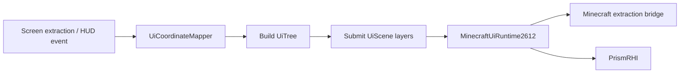

# Epsilon GUI 架构

> 公共 Lumin API、资源所有权和 Minecraft 接入边界见
> [Lumin GUI 集成边界](gui-library.md)。

## 业务宿主

Epsilon 的 GUI 由四类宿主组成：

- `PanelScreen`：模块浏览、Setting 编辑和客户端数据页。
- `DropdownScreen`：可拖动分类面板、搜索和 Setting 控件。
- `MainMenuScreen`：主菜单背景与操作入口。
- `HudEditorScreen`：HUD 布局、锚点、选择框和预览。

这些宿主持有业务状态和输入交互，不拥有另一套通用 GUI 库。几何、树、场景和文本类型直接来自
LuminGraphics；Minecraft runtime 适配来自 LuminGraphics-MC。

## 渲染链



每个 Screen 每帧只使用一个 `UiScene`。调用 `MinecraftUiRuntime2612.current()` 后先配置字体，
再在 `runtime.render(...)` 回调中构建和提交节点。Screen 移除或 runtime 变化时关闭旧 scene。

## Panel 与 Dropdown

Panel 业务组件位于 `gui/panel`，Dropdown 业务组件位于 `gui/dropdown`。Setting 的可见性、分组和
布局仍由 SettingHost 与相邻 controller/view 决定；公共 Lumin 树不读取 Module 或 Setting。

Popup 由宿主统一管理，使用 `UiLayer.POPUP`。滚动区域的 scissor 和滚动条必须提交到宿主 scene，
不得为每个 Panel 或列表创建独立 renderer。存在 painter order 的 background、content、floating 和
popup pass 必须使用显式相对 layer。

## HUD

`HudElementHolder` 在原版 HUD 提取结束后构建独立 HUD tree。每个启用的 `HudModule` 通过
`appendToTree` 向隔离的子 scope 追加节点，整棵树一次提交。HUD Editor 预览复用同一路径，并将
HUD tree 放在 editor chrome 的独立相对 layer；不得再逐元素调用独立 batch。

HUD 尺寸通过 `setBounds()` 更新，移动通过 anchor/move API 完成。HUD 的原版物品和其他
`GuiGraphicsExtractor` overlay 继续走 `renderOverlay`，不塞入 Lumin UI tree。

## 坐标和命中

所有 Screen 输入先通过 `UiCoordinateMapper` 转换到 Lumin 投影坐标。布局、文本测量、scissor 和
命中测试使用同一逻辑尺寸，不得额外除以 GUI scale。Dropdown 的拖动 delta 也必须转换到投影空间。

## 字体和主题

`ClientSetting.configureMinecraftFonts(runtime)` 统一注册默认字体、图标字体和其他 font id。
绘制与测量必须使用相同 font id 和 scale。业务色通过 `EpsilonUiTheme.lumin` 转换，不得在控件中
维护独立 atlas 或 renderer。自定义字体的相对值从 `.epsilon/fonts/` 和操作系统字体目录解析，
不使用 Minecraft 的当前运行目录。`Font Scale` 在 LuminGraphics-MC 的 UI 文字基准倍率上继续缩放，
对默认字体和自定义字体同时生效，并保持绘制与测量一致。

## 验证

仓库当前不维护 GUI 测试源码。修改 Screen、HUD 或 layer 顺序后至少运行双平台编译，并启动受影响的
客户端路径检查坐标、字体、scissor 和 painter order：

```powershell
.\gradlew.bat :common:compileJava
.\gradlew.bat :fabric:compileJava :neoforge:compileJava
```
